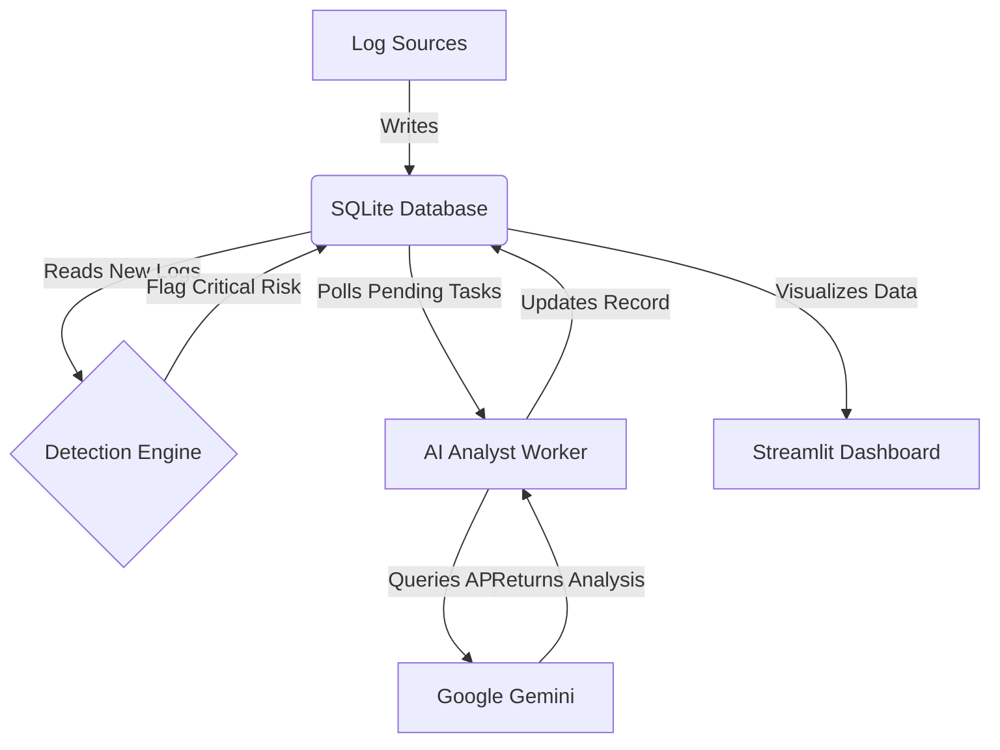

# K.A.R.E.N. 🚨
## Keen Analysis & Rapid Elimination Network

> *"I'd like to speak to your firewall administrator RIGHT NOW"*

An AI-powered Security Operations Center (SOC) that combines real-time threat detection with automated response capabilities.


---

## Overview

K.A.R.E.N. is a security monitoring platform that demonstrates how AI can enhance traditional security operations. The system monitors network activity and system events, applies rule-based detection logic, and leverages Google's Gemini AI to provide context-aware threat analysis.

Unlike conventional monitoring tools that rely solely on static signatures, K.A.R.E.N. enriches each security event with infrastructure context, enabling the AI to differentiate between benign anomalies and genuine threats. The platform also includes an Active Defense module capable of autonomous threat mitigation.

## Core Capabilities

**Asynchronous AI Analysis**
The detection engine operates independently from AI processing. Events are flagged and queued for analysis without blocking the main detection loop, ensuring continuous monitoring performance.

**Context-Aware Intelligence**
Each security event is enriched with asset metadata (server criticality, user baselines, network zones) before AI analysis. This contextual information allows the system to prioritize threats accurately—a failed login attempt on a development server receives different treatment than the same event on a production database.

**Active Defense Mechanism**
When specific threat patterns are detected (e.g., brute-force login bursts), K.A.R.E.N. can automatically terminate malicious processes. This autonomous response capability reduces the time between detection and mitigation.

**Real-Time Visualization**
A Streamlit-based dashboard provides live threat monitoring, analytics, and event correlation. The interface includes threat distribution maps, attack pattern tracking, and AI analysis results.

**Simplified Deployment**
The entire stack can be launched via a single batch script, making it straightforward to deploy for testing or demonstration purposes.

## Architecture

K.A.R.E.N. follows a modular, event-driven architecture with five distinct layers:



### 1. Ingestion Layer

**`log_generator.py`**
Simulates realistic network traffic patterns with configurable risk distributions. Generates events across multiple severity levels (Normal: 70%, Warning: 25%, Critical: 5%) to test detection and analysis workflows.

**`windows_shipper.py`**
Host-based agent that monitors Windows Event Logs in real-time. Specifically listens for Event ID 4625 (Failed Login Attempts) and implements burst detection logic for brute-force identification.

### 2. Storage Layer

**`soc_database.db`**
SQLite database serving as the central event store and message queue. Handles concurrent writes from multiple agents and supports the asynchronous task processing model.

### 3. Detection Layer

**`detection.py`**
Continuously polls the database for new events and applies rule-based logic to identify suspicious activity. Flagged events are marked with a "pending" status for AI review.

### 4. Intelligence Layer

**`ai_worker.py`**
Asynchronous worker process that retrieves flagged events, enriches them with asset context from `threat_db.json`, and queries the Gemini API for threat assessment and recommended actions.

### 5. Visualization Layer

**`dashboard.py`**
Streamlit-based interface that aggregates and displays security metrics, live event streams, AI analysis results, and threat visualization.

---

## Installation

### Prerequisites

- Python 3.10 or higher
- Google Cloud API Key (Gemini API)
- Windows OS (required only for `windows_shipper.py` Active Defense module)

### Setup Instructions

**1. Clone the repository**

```bash
git clone https://github.com/YOUR_USERNAME/karen-soc.git
cd karen-soc
```

**2. Install dependencies**

```bash
pip install -r requirements.txt
```

**3. Configure environment variables**

Create a `.env` file in the project root:

```env
GEMINI_API_KEY="your_api_key_here"
```

**4. Initialize the database**

```bash
python db_setup.py
```

---

## Usage

### Option A: Automated Startup (Recommended)

Execute the batch launcher to start all components simultaneously:

```bash
start_soc.bat
```

This will open four terminal windows:
- Log Generator (Traffic Simulation)
- Detection Engine
- AI Analyst Worker
- Dashboard (accessible at `http://localhost:8501`)

### Option B: Manual Startup

Start each component in separate terminal sessions:

```bash
# Terminal 1: Traffic Simulation
python log_generator.py

# Terminal 2: Detection Engine
python detection.py

# Terminal 3: AI Analyst
python ai_worker.py

# Terminal 4: Dashboard
streamlit run dashboard.py
```

---

## Testing

### Simulation Mode (Safe)

1. Launch the platform using either startup method
2. Observe the Log Generator terminal for event creation
3. Watch for critical events (marked in red)
4. Verify detection in the Detection Engine terminal
5. Confirm AI analysis appears in the Dashboard under "AI Analysis"

The system generates a critical event approximately every 2-3 minutes under default configuration.

### Active Defense Mode (Advanced)

**Warning:** This mode will terminate processes on the host system. Use only in controlled environments.

1. Run `windows_shipper.py` with Administrator privileges
2. Trigger multiple rapid login failures (e.g., 3+ failed unlock attempts within 10 seconds)
3. Observe the burst detection logic activate
4. Verify the Active Defense trigger in the dashboard logs

The default configuration terminates processes matching the attack pattern. Review and modify the `neutralize_threat()` function in `windows_shipper.py` before testing.

---

## Configuration

### Asset Context Database

Edit `threat_db.json` to define your infrastructure:

```json
{
  "assets": {
    "192.168.1.15": {
      "name": "Finance Server",
      "criticality": "high",
      "owner": "Finance Department"
    }
  }
}
```

This context is injected into AI prompts to improve threat prioritization.

### Detection Rules

Modify risk thresholds in `detection.py`:

```python
if event['status'] == 'failed' and event['risk_level'] == 'high':
    flag_for_analysis(event)
```

### AI Analysis

Customize the AI prompt template in `ai_worker.py` to adjust analysis depth and response format.

---

## Known Issues

- **Threat Map Visualization**: Currently displays simulated geographic data rather than actual source IPs
- **AI Response Variability**: Analysis quality depends on prompt engineering and may require tuning for specific use cases
- **Error Handling**: Some edge cases in concurrent database access may not be fully handled
- **Windows Dependency**: Active Defense module requires Windows Event Log access

---

## Development Roadmap

### Planned Improvements

- [ ] **Network Packet Capture**: Direct packet analysis via Scapy or similar libraries
- [ ] **Threat Intelligence Integration**: Automated enrichment with external threat feeds (VirusTotal, AlienVault OTX)
- [ ] **Machine Learning Models**: Anomaly detection using unsupervised learning for baseline deviation
- [ ] **Enhanced Active Defense**: Configurable response actions (quarantine, rate limiting, process suspension)
- [ ] **Multi-Agent Support**: Distributed deployment across multiple hosts
- [ ] **API Endpoints**: REST API for external integrations
- [ ] **Unit Tests**: Comprehensive test coverage for core modules

### Potential Features

- Alert correlation and incident timeline reconstruction
- MITRE ATT&CK framework mapping for detected techniques
- Integration with SIEM platforms (Splunk, ELK Stack)
- Webhook support for third-party notifications (Slack, PagerDuty)

---

## Contributing

Contributions are welcome. Please follow these guidelines:

1. **Fork the repository** and create a feature branch
2. **Follow existing code structure** and naming conventions
3. **Add comments** for complex logic blocks
4. **Test thoroughly** before submitting pull requests
5. **Update documentation** if you modify functionality

Areas where contributions would be particularly valuable:
- Improved error handling and logging
- Additional detection rules and patterns
- Performance optimization for high-volume environments
- Cross-platform compatibility improvements

---

## Technical Details

### Database Schema

Events are stored with the following structure:

```sql
CREATE TABLE security_events (
    id INTEGER PRIMARY KEY,
    timestamp TEXT,
    source_ip TEXT,
    destination_ip TEXT,
    event_type TEXT,
    status TEXT,
    risk_level TEXT,
    ai_analysis TEXT,
    analysis_status TEXT
);
```

### Asynchronous Processing

The system uses a polling-based task queue:

1. Detection engine writes events with `analysis_status = 'pending'`
2. AI worker queries for pending events
3. After analysis, worker updates `analysis_status = 'complete'`
4. Dashboard displays both pending and completed analyses

This decoupling ensures the detection engine never blocks on AI API calls.

---

## License

MIT License - see LICENSE file for details

---

**K.A.R.E.N. - Keen Analysis & Rapid Elimination Network**  
*An educational security monitoring platform demonstrating AI-enhanced threat detection*
